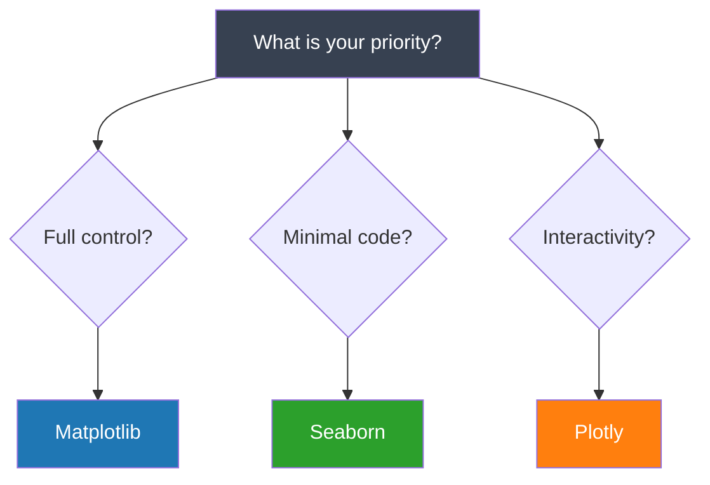

# Why Visualize Data?

<div class="text-lg opacity-80 mt-2">See patterns. Spot outliers. Tell stories.</div>

---
layout: default
---

# Numbers Can Deceive

<div class="text-xs opacity-70 mb-2">
<strong>Anscombe's Quartet (1973):</strong> Four datasets with identical summary statistics but wildly different distributions.
</div>

<style>
.compact-table tr { line-height: 1.3; }
.compact-table td { padding: 1px 4px; }
</style>

<div class="grid grid-cols-4 gap-2" style="font-size: 10px;">

<div class="border border-blue-500/40 rounded p-1 bg-blue-500/5">
<div class="font-semibold text-blue-400 text-center text-xs">Dataset I</div>
<table class="w-full font-mono text-center compact-table">
<tr class="border-b border-blue-500/20"><td class="opacity-70">x</td><td class="opacity-70">y</td></tr>
<tr><td>10</td><td>8.04</td></tr>
<tr><td>8</td><td>6.95</td></tr>
<tr><td>13</td><td>7.58</td></tr>
<tr><td>9</td><td>8.81</td></tr>
<tr><td>11</td><td>8.33</td></tr>
<tr><td>14</td><td>9.96</td></tr>
<tr><td>6</td><td>7.24</td></tr>
<tr><td>4</td><td>4.26</td></tr>
<tr><td>12</td><td>10.84</td></tr>
<tr><td>7</td><td>4.82</td></tr>
<tr><td>5</td><td>5.68</td></tr>
</table>
</div>

<div class="border border-green-500/40 rounded p-1 bg-green-500/5">
<div class="font-semibold text-green-400 text-center text-xs">Dataset II</div>
<table class="w-full font-mono text-center compact-table">
<tr class="border-b border-green-500/20"><td class="opacity-70">x</td><td class="opacity-70">y</td></tr>
<tr><td>10</td><td>9.14</td></tr>
<tr><td>8</td><td>8.14</td></tr>
<tr><td>13</td><td>8.74</td></tr>
<tr><td>9</td><td>8.77</td></tr>
<tr><td>11</td><td>9.26</td></tr>
<tr><td>14</td><td>8.10</td></tr>
<tr><td>6</td><td>6.13</td></tr>
<tr><td>4</td><td>3.10</td></tr>
<tr><td>12</td><td>9.13</td></tr>
<tr><td>7</td><td>7.26</td></tr>
<tr><td>5</td><td>4.74</td></tr>
</table>
</div>

<div class="border border-orange-500/40 rounded p-1 bg-orange-500/5">
<div class="font-semibold text-orange-400 text-center text-xs">Dataset III</div>
<table class="w-full font-mono text-center compact-table">
<tr class="border-b border-orange-500/20"><td class="opacity-70">x</td><td class="opacity-70">y</td></tr>
<tr><td>10</td><td>7.46</td></tr>
<tr><td>8</td><td>6.77</td></tr>
<tr><td>13</td><td>12.74</td></tr>
<tr><td>9</td><td>7.11</td></tr>
<tr><td>11</td><td>7.81</td></tr>
<tr><td>14</td><td>8.84</td></tr>
<tr><td>6</td><td>6.08</td></tr>
<tr><td>4</td><td>5.39</td></tr>
<tr><td>12</td><td>8.15</td></tr>
<tr><td>7</td><td>6.42</td></tr>
<tr><td>5</td><td>5.73</td></tr>
</table>
</div>

<div class="border border-purple-500/40 rounded p-1 bg-purple-500/5">
<div class="font-semibold text-purple-400 text-center text-xs">Dataset IV</div>
<table class="w-full font-mono text-center compact-table">
<tr class="border-b border-purple-500/20"><td class="opacity-70">x</td><td class="opacity-70">y</td></tr>
<tr><td>8</td><td>6.58</td></tr>
<tr><td>8</td><td>5.76</td></tr>
<tr><td>8</td><td>7.71</td></tr>
<tr><td>8</td><td>8.84</td></tr>
<tr><td>8</td><td>8.47</td></tr>
<tr><td>8</td><td>7.04</td></tr>
<tr><td>8</td><td>5.25</td></tr>
<tr><td>19</td><td>12.50</td></tr>
<tr><td>8</td><td>5.56</td></tr>
<tr><td>8</td><td>7.91</td></tr>
<tr><td>8</td><td>6.89</td></tr>
</table>
</div>

</div>

<div class="mt-3 grid grid-cols-2 gap-3">

<div class="p-2 border border-gray-500/30 rounded bg-gray-500/5">
<div class="text-xs font-semibold mb-1">All Four Datasets Share:</div>
<div class="grid grid-cols-2 gap-1" style="font-size: 10px;">
<div class="flex justify-between"><span class="opacity-70">Mean of X:</span><span class="font-mono text-white">9.0</span></div>
<div class="flex justify-between"><span class="opacity-70">Mean of Y:</span><span class="font-mono text-white">7.5</span></div>
<div class="flex justify-between"><span class="opacity-70">Correlation:</span><span class="font-mono text-white">0.816</span></div>
<div class="flex justify-between"><span class="opacity-70">Regression:</span><span class="font-mono text-white">y = 0.5x + 3</span></div>
</div>
</div>

<div class="flex items-center justify-center p-2 border-2 border-dashed border-gray-500/40 rounded">
<div class="text-center">
<div class="text-2xl opacity-40">?</div>
<div class="text-xs font-semibold">What do these datasets look like when plotted?</div>
</div>
</div>

</div>

---
layout: default
---

# Same Statistics, Different Patterns

<div class="text-xs opacity-80 mb-2">Four datasets that share identical summary statistics but tell completely different stories.</div>

<div class="grid grid-cols-5 gap-4">

<div class="col-span-3">

</div>

<div class="col-span-2 flex flex-col justify-between">

<div class="space-y-2 text-xs">
  <div class="p-2 bg-blue-500/10 rounded"><strong>I: Linear</strong><br/><span class="opacity-70">A true linear relationship where the regression line fits well. This is what the statistics suggest all datasets should look like.</span></div>
  <div class="p-2 bg-green-500/10 rounded"><strong>II: Curved</strong><br/><span class="opacity-70">The data follows a clear curve, but linear regression misses it entirely. Lesson: always check for nonlinear patterns.</span></div>
  <div class="p-2 bg-orange-500/10 rounded"><strong>III: Outlier</strong><br/><span class="opacity-70">One extreme point (y=12.74) dramatically influences the regression line. Without visualization, you would never know.</span></div>
  <div class="p-2 bg-purple-500/10 rounded"><strong>IV: Clustered</strong><br/><span class="opacity-70">All points cluster at x=8 except one at x=19. The regression is entirely determined by that single outlier.</span></div>
</div>

<div class="p-2 border-l-4 border-orange-500 bg-orange-500/10 text-xs mt-3">
<strong>Always visualize your data before analysis.</strong> Summary statistics can completely miss patterns, outliers, and data quality issues.
</div>

</div>

</div>

---
layout: default
---

# The Python Visualization Stack

<div class="grid grid-cols-3 gap-6 mt-8">

<div class="text-center p-4 border rounded border-blue-500/30 bg-blue-500/5">


<h3 class="text-lg font-semibold text-blue-400">Matplotlib</h3>

<div class="text-sm opacity-70 mt-2">

Full control for publications

</div>

<div class="mt-4 text-xs text-left">

- Foundation of Python plotting
- Pixel-perfect customization
- PDF, PNG, SVG export

</div>

</div>

<div class="text-center p-4 border rounded border-green-500/30 bg-green-500/5">


<h3 class="text-lg font-semibold text-green-400">Seaborn</h3>

<div class="text-sm opacity-70 mt-2">

Beautiful statistical plots fast

</div>

<div class="mt-4 text-xs text-left">

- Built on Matplotlib
- One-line statistical charts
- Works with DataFrames

</div>

</div>

<div class="text-center p-4 border rounded border-orange-500/30 bg-orange-500/5">


<h3 class="text-lg font-semibold text-orange-400">Plotly</h3>

<div class="text-sm opacity-70 mt-2">

Interactive web visualizations

</div>

<div class="mt-4 text-xs text-left">

- Hover, zoom, pan
- Animations
- HTML export

</div>

</div>

</div>

---
layout: default
---

# When to Use What

<div class="grid grid-cols-2 gap-8">

<div>



</div>

<div class="flex flex-col justify-center space-y-4">

<div class="p-3 border-l-4 border-blue-500 bg-blue-500/10 text-sm">
<strong class="text-blue-400">Matplotlib</strong><br/>
Publication-quality figures with pixel-perfect control over every element
</div>

<div class="p-3 border-l-4 border-green-500 bg-green-500/10 text-sm">
<strong class="text-green-400">Seaborn</strong><br/>
Quick exploration with beautiful defaults and minimal code
</div>

<div class="p-3 border-l-4 border-orange-500 bg-orange-500/10 text-sm">
<strong class="text-orange-400">Plotly</strong><br/>
Dashboards and web apps with interactive hover, zoom, and pan
</div>

<div class="text-sm opacity-70 mt-2">
Note: All three can create statistical plots. Choose based on workflow priorities.
</div>

</div>

</div>

---
layout: default
---

# Built-in Datasets

We will use datasets that come with the libraries - no downloads needed.

<div class="grid grid-cols-3 gap-6 mt-6">

<div class="p-4 border rounded">

### Tips

Restaurant tipping data

```python
import seaborn as sns
tips = sns.load_dataset("tips")
```

<div class="text-xs opacity-70 mt-2">

244 rows: bill, tip, day, time, size

</div>

</div>

<div class="p-4 border rounded">

### Penguins

Palmer penguins measurements

```python
import seaborn as sns
df = sns.load_dataset(
    "penguins")
```

<div class="text-xs opacity-70 mt-2">

344 rows: species, bill, flipper, mass

</div>

</div>

<div class="p-4 border rounded">

### Gapminder

World development data

```python
import plotly.express as px
df = px.data.gapminder()
```

<div class="text-xs opacity-70 mt-2">

1704 rows: country, year, GDP, life expectancy

</div>

</div>

</div>
